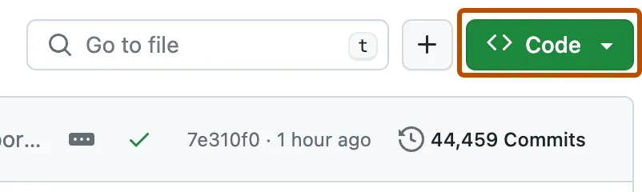
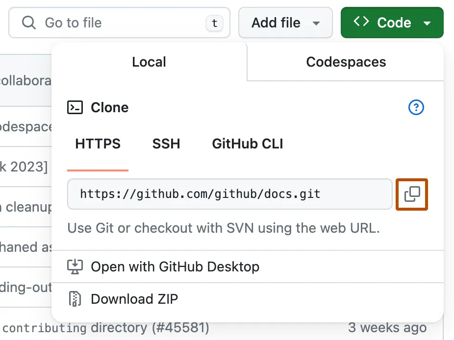

# :wave: Your Local Dev Environment

## 🤓 Course overview and learning outcomes

The goal of this course is to give you a brief introduction to Git, GitHub, and Dev Containers. These are the tools you will need to succesfully work on exercises in your current course.

**IMPORTANT:** Every time you see the ❗ there are tasks for you to do.

## :octocat: Git

Git is a **distributed Version Control System (VCS)**, which means it is a useful tool for easily tracking changes to your code, collaborating, and sharing. With Git you can track the changes you make to your project so you always have a record of what you’ve worked on and can easily revert back to an older version if need be. It also makes working with others easier—groups of people can work together on the same project and merge their changes into one final source!

#### :exclamation: Git CLI

A CLI is a Command Line Interface. It is a tool that allows us to run commans from a terminal.

In order to use Git, you need to make sure the Git CLI it is installed on your computer. If it’s already installed, it’s a good idea to update to the latest version. You can either install it as a package or via another installer, or download the source code and compile it yourself. Follow the instruction [here](https://git-scm.com/book/en/v2/Getting-Started-Installing-Git) to install or update to the latest git cli version.

Once installed you should be able to run the `git` command from the terminal:

```
$ git --version
git version 2.47.0
```

\*Your version may be slightly different than the one shown here.

Once you have git installed configure your name and email:

```bash
git config --global user.email "you@atlasschool.com"
git config --global user.name "Your Name"
```

## :octocat: GitHub

GitHub is a way to use the same power of Git all online with an easy-to-use interface. It’s used across the software world and beyond to collaborate and maintain the history of projects.

GitHub is home to some of the most advanced technologies in the world. Whether you're visualizing data or building a new game, there's a whole community and set of tools on GitHub that can get you to the next step. This course starts with the basics of GitHub, but we'll dig into the rest later.

#### :exclamation: GitHub CLI

The GitHub CLI is GitHub on the command line. It brings pull requests, issues, and other GitHub concepts to the terminal next to where you are already working with git and your code. We will use the GitHub CLI to set up authentication with GitHub to make pulling and pushing code easier. Follow the instruction [here](https://cli.github.com/) to install the Github CLI.

Once installed you should be able to run the `gh` command from the terminal:

```
$ gh --version
gh version 2.60.1 (2024-10-25)
```

\*Your version may be slightly different than the one shown here.

Once the `gh` cli is installed you will need to login to GitHub. Run `gh auth login` from your terminal and follow the prompts as below:

```bash
$ gh auth login
? Where do you use GitHub? GitHub.com
? What is your preferred protocol for Git operations on this host? HTTPS
? How would you like to authenticate GitHub CLI? Login with a web browser
...
```

Once you have logged into GitHub, Run the `gh auth setup-git` command from your terminal. This command configures git to use GitHub CLI as a credential helper. This will allow you to access your private repositories hosted in GitHub from your local terminal.

```bash
$ gh auth setup-git
```

## Dev Containers

Imagine you're working on a project with a bunch of tools, libraries, and settings on your computer. But then, you pass that project to a friend, and they can't get it to work on their computer because their setup is a little different from yours. This is a common issue in software development, and development containers help solve it.

A development container is like a mini-computer inside your computer. It has its own environment, including a specific operating system, versions of programming languages, tools, libraries, and configurations that the project needs to run properly. By putting your project inside this container, you can make sure it works the same way for everyone, regardless of their computer's setup.

Many development environments, like Visual Studio Code, support development containers. This means you can open a project, and it will set up the container for you automatically.

#### ❗ Install Docker and Dev Containers

1. You need [Visual Studio Code](https://code.visualstudio.com/) installed
2. Install and configure [Docker Desktop](https://www.docker.com/products/docker-desktop/) for your operating system.
3. Run the Docker Desktop application to start Docker. You will know it's running if you look in the activity tray and see the Docker whale icon. Docker might take a few minutes to start. If the whale icon is animated, it is probably still in the process of starting. You can click on the icon to see the status.
4. Once Docker is running, you can confirm that everything is working by opening a new terminal window and typing the command:

```
$ docker --version
```

5. Install the [Dev Containers extension](https://marketplace.visualstudio.com/items?itemName=ms-vscode-remote.remote-containers)
6. Check installation. With the Dev Containers extension installed, you will see a new Status bar item at the far left.

## :octocat: Understanding your Local Development Workflow flow

The git workflow is a lightweight workflow that allows you to experiment and collaborate on your projects easily, without the risk of losing your previous work.

### Repositories

A repository is where your project work happens--think of it as your project folder. It contains all of your project’s files and revision history. You can work within a repository alone or invite others to collaborate with you on those files.

### Cloning

When a repository is created with GitHub, it’s stored remotely in the ☁️. You can clone a repository to create a local copy on your computer and then use Git to sync the two. This makes it easier to fix issues, add or remove files, and push larger commits. You can also use the editing tool of your choice as opposed to the GitHub UI. Cloning a repository also pulls down all the repository data that GitHub has at that point in time, including all versions of every file and folder for the project! This can be helpful if you experiment with your project and then realize you liked a previous version more.
To learn more about cloning, read ["Cloning a Repository"](https://docs.github.com/en/github/creating-cloning-and-archiving-repositories/cloning-a-repository).

#### :exclamation: Clone this repository

1. Above the list of files, click **<> Code**.



1. Copy the **HTTP** URL for the repository (Do not copy the SSH or GitHub CLI option).



1. Open Terminal.
2. Change the current working directory to the location where you want the cloned directory.
3. Type `git clone`, and then paste the URL you copied earlier.

```
git clone https://github.com/YOUR-USERNAME/YOUR-REPOSITORY
```

1. Press **Enter** to create your local clone.

```
$ git clone https://github.com/YOUR-USERNAME/YOUR-REPOSITORY
> Cloning into `YOUR-REPOSITORY`...
> remote: Counting objects: 10, done.
> remote: Compressing objects: 100% (8/8), done.
> remove: Total 10 (delta 1), reused 10 (delta 1)
> Unpacking objects: 100% (10/10), done.
```

You should now see a folder with the name of your repository in your current directory containing a copy of all of the files in the repository.

#### Open in Dev Container

1. Open

### Using markdown files

You can add some fun styling to your issues, pull requests, and files (Typically ending in \*.md). ["Markdown"](https://guides.github.com/features/mastering-markdown/) is an easy way to style your issues, pull requests, and files with some simple syntax. This can be helpful to organize your information and make it easier for others to read. You can also drop in gifs and images to help convey your point!
To learn more about using GitHub’s flavor of markdown, read ["Basic Writing and Formatting Syntax"](https://docs.github.com/en/github/writing-on-github/basic-writing-and-formatting-syntax).

This README you are reading is a markdown file. You can see the source code by clicking the pencil at the top of this README.

#### ❗ Create ABOUTME.md

1. In the repository you cloned locally create a new file called **ABOUTME.md**
2. Add some markdown with some information about your self.

### Committing and pushing

**Committing** and **pushing** are how you can add the changes you made on your local machine to the remote repository in GitHub. That way your instructor and/or teammates can see your latest work when you’re ready to share it. You can make a commit when you have made changes to your project that you want to “checkpoint.” You can also add a helpful **commit message** to remind yourself or your teammates what work you did (e.g. “Added a README with information about our project”).

Once you have a commit (or multiple commits) that you’re ready to add to your repository in GitHub, you can use the push command to add those changes to your remote repository. Committing and pushing may feel new at first, but we promise you’ll get used to it 🙂

#### ❗ Commit and push your changes

Run `git status`. This is the main tool you use to determine which files are in which state. If you created your ABOUTME.md file, you should see something like this:

```bash
$ git status
On branch main
Your branch is up to date with 'origin/main'.

Untracked files:
  (use "git add <file>..." to include in what will be committed)
        ABOUTME.md
```

You can see that your new **ABOUTME.md** file is untracked, because it’s under the “Untracked files” heading in your status output. Untracked basically means that Git sees a file you didn’t have in the previous snapshot (commit), and which hasn’t yet been staged; Git won’t start including it in your commits until you explicitly tell it to do so. It does this so you don’t accidentally begin including files that you did not mean to include. You do want to start including **ABOUTME.md**, so let’s start tracking the file.

In order to begin tracking a new file, you use the command git add. To begin tracking the ABOUTME.md file, you can run this:

```bash
$ git add ABOUTME.md
```

If you run your status command again, you can see that your README file is now tracked and staged to be committed:

```bash
$ git status
On branch main
Your branch is up to date with 'origin/main'.

Changes to be committed:
  (use "git restore --staged <file>..." to unstage)
        new file:   ABOUTME.md
```

You can tell that it’s staged because it’s under the “Changes to be committed” heading. If you commit at this point, the version of the file at the time you ran git add is what will be in the subsequent historical snapshot.

Now that your staging area is set up the way you want it, you can commit your changes. Remember that anything that is still unstaged — any files you have created or modified that you haven’t run git add on since you edited them — won’t go into this commit. They will stay as modified files on your disk. In this case, let’s say that the last time you ran git status, you saw that everything was staged, so you’re ready to commit your changes. The simplest way to commit is to type git commit:

```bash
$ git commit -m "Add ABOUTME"
```

`-m` allows you to specify your commit message inline. If this is not included you will be prompted to create your commit message. The commit message is a description of what changes are being captures in the commit.

Now when you run `git status` you should no longer see any files to be committed:

```
 $ git status
On branch main
Your branch is ahead of 'origin/main' by 1 commit.
  (use "git push" to publish your local commits)

nothing to commit, working tree clean
```

You will notice it says "Your branch is ahead of 'origin/main' by 1 commit". Your changes have been committed locally but you will not see them in GitHub. In order to sync your local changes with github you need to "push" the commits from your local repository to you remote repository. To do this run the `git push` commmand:

```
$ git push
Enumerating objects: 4, done.
Counting objects: 100% (4/4), done.
Delta compression using up to 12 threads
Compressing objects: 100% (2/2), done.
Writing objects: 100% (3/3), 327 bytes | 327.00 KiB/s, done.
Total 3 (delta 0), reused 0 (delta 0), pack-reused 0 (from 0)
To https://github.com/YOUR-USERNAME/github-starter-course.git
   55982ed..28762b2  main -> main
```

You should now see your ABOUTME.md file in your repository on GitHub.com

## 💻 GitHub terms to know

### Repositories

We mentioned repositories already, they are where your project work happens, but let’s talk a bit more about the details of them! As you work more on GitHub you will have many repositories which may feel confusing at first. Fortunately, your ["GitHub dashboard"](https://docs.github.com/en/github/setting-up-and-managing-your-github-user-account/about-your-personal-dashboard) helps to easily navigate to your repositories and see useful information about them. Make sure you’re logged in to see it!

Repositories also contain **README**s. You can add a README file to your repository to tell other people why your project is useful, what they can do with your project, and how they can use it. We are using this README to communicate how to learn Git and GitHub with you. 😄
To learn more about repositories read ["Creating, Cloning, and Archiving Repositories](https://docs.github.com/en/github/creating-cloning-and-archiving-repositories/about-repositories) and ["About README's"](https://docs.github.com/en/github/creating-cloning-and-archiving-repositories/about-readmes).

### Branches

You can use branches on GitHub to isolate work that you do not want merged into your final project just yet. Branches allow you to develop features, fix bugs, or safely experiment with new ideas in a contained area of your repository. Typically, you might create a new branch from the default branch of your repository—main. This makes a new working copy of your repository for you to experiment with. Once your new changes have been reviewed by a teammate, or you are satisfied with them, you can merge your changes into the default branch of your repository.
To learn more about branching, read ["About Branches"](https://docs.github.com/en/github/collaborating-with-issues-and-pull-requests/about-branches).

### Forks

A fork is another way to copy a repository, but is usually used when you want to contribute to someone else’s project. Forking a repository allows you to freely experiment with changes without affecting the original project and is very popular when contributing to open source software projects!
To learn more about forking, read ["Fork a repo"](https://docs.github.com/en/github/getting-started-with-github/fork-a-repo)

### Pull requests

When working with branches, you can use a pull request to tell others about the changes you want to make and ask for their feedback. Once a pull request is opened, you can discuss and review the potential changes with collaborators and add more changes if need be. You can add specific people as reviewers of your pull request which shows you want their feedback on your changes! Once a pull request is ready-to-go, it can be merged into your main branch.
To learn more about pull requests, read ["About Pull Requests"](https://docs.github.com/en/github/collaborating-with-issues-and-pull-requests/about-pull-requests).

#### ❗ View a pull request

1. Go to you repository on Github.com
2. Click on the **Pull Requests** tab at the top of the repository.
3. You should see one pull request automatically created for you titled "Feedback". Click into this PR. This is where your instructor will leave feedback on your exercises.
4. If you click on the "Files Changed" tab you will see a diff of every file changed.

Pull requests are a useful tool for reviewing code changes before they are merged into a repository or branch. When working on software teams it is common to use pull requests to have teammates review your code before they ca be merged into your main or production branches.

### Your user profile

Your profile page tells people the story of your work through the repositories you're interested in, the contributions you've made, and the conversations you've had. You can also give the world a unique view into who you are with your profile README. You can use your profile to let future employers know all about you!
To learn more about your user profile and adding and updating your profile README, read ["Managing Your Profile README"](https://docs.github.com/en/github/setting-up-and-managing-your-github-profile/managing-your-profile-readme).

#### ❗Create your profile

Create your profile README. Let the world know a little bit more about you! What are you interested in learning? What are you working on? What's your favorite hobby? Learn more about creating your profile README in the document, ["Managing Your Profile README"](https://docs.github.com/en/github/setting-up-and-managing-your-github-profile/managing-your-profile-readme).

## 📚 Resources

- [A short video explaining what GitHub is](https://www.youtube.com/watch?v=w3jLJU7DT5E&feature=youtu.be)
- [Git and GitHub learning resources](https://docs.github.com/en/github/getting-started-with-github/git-and-github-learning-resources)
- [Understanding the GitHub flow](https://guides.github.com/introduction/flow/)
- [How to use GitHub branches](https://www.youtube.com/watch?v=H5GJfcp3p4Q&feature=youtu.be)
- [Interactive Git training materials](https://githubtraining.github.io/training-manual/#/01_getting_ready_for_class)
- [GitHub's Learning Lab](https://lab.github.com/)
- [Education community forum](https://education.github.community/)
- [GitHub community forum](https://github.community/)
